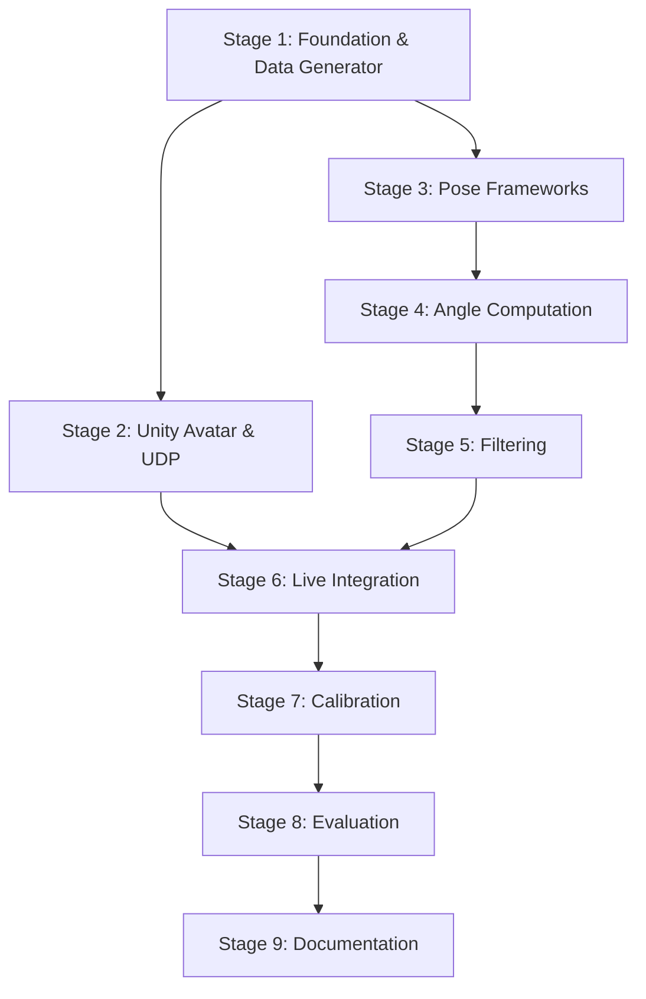

# MonoArm — Staged Build Plan

> Each stage is self-contained, reviewable, and testable before moving to the next.
> No stage should take more than a focused work session to review.

---

## Summary of Locked Technical Decisions

| # | Decision | Choice |
|---|---|---|
| 1 | Pose data type | Pseudo-3D (MediaPipe z-coordinate) |
| 2 | Coordinate frame | Hybrid anatomical (ISB-inspired, ZXY Euler decomposition) |
| 3 | Filtering location | Layered (Python: signal filtering, Unity: animation smoothing) |
| 4 | Unity avatar mapping | Muscle System (HumanPoseHandler) |
| 5 | Calibration | Hybrid (static poses + dynamic refinement + auto-adjust) |
| 6 | Ground truth dataset | Human3.6M (primary) + custom reference poses (secondary) |
| 7 | Python architecture | Modular package with abstract interfaces + config.yaml |

---

## Stage 1 — Project Foundation & Data Generator

**Goal:** Set up the full project structure, config system, and a working data generator that sends simulated arm angles over UDP.

### What gets built:
- Complete directory structure (Python + Unity folders)
- `requirements.txt` with all dependencies
- `config.yaml` with all tunable parameters
- Abstract base classes (`PoseEstimator`, `Filter`)
- UDP sender module
- **Data generator app** — sends sinusoidal/stepped angle values over UDP simulating shoulder flexion, abduction, rotation, and elbow flexion

### Deliverables:
- `D:\MonoArm\python\` fully scaffolded
- `python/src/data_generator.py` — runs from CLI, sends UDP packets
- `python/src/communication/udp_sender.py`
- `python/configs/config.yaml`
- All base interfaces defined

### How to verify:
- Run `python src/data_generator.py`
- Use a simple UDP listener script to confirm packets arrive in format `S,flex,abd,rot,elb_flex\n`
- Angles cycle through realistic ranges smoothly

### Why this stage first:
The data generator lets us develop and test the **entire Unity side independently** from the vision pipeline. No camera needed yet.

---

## Stage 2 — Unity Avatar Setup & UDP Control

**Goal:** Set up a Unity project with a humanoid avatar whose right arm is driven by incoming UDP angle data.

### What gets built:
- Unity project at `D:\MonoArm\unity\MonoArmAvatar\`
- Free humanoid avatar imported and configured with Humanoid rig
- C# UDP receiver script (listens on configured port)
- C# angle parser (parses `S,flex,abd,rot,elb_flex` format)
- C# avatar controller using `HumanPoseHandler` / muscle system
- Lerp-based animation smoothing (frame-rate independent)

### Deliverables:
- Working Unity scene with avatar
- `UDPReceiver.cs`, `AngleParser.cs`, `AvatarController.cs`, `AnimationSmoother.cs`
- Step-by-step Unity setup guide (for user who needs guidance)

### How to verify:
- Run Stage 1's data generator → avatar's right arm moves smoothly
- Arm responds correctly: flexion moves arm forward, abduction moves arm out, elbow bends
- No jitter, no snapping, smooth interpolation
- Works at 30 Hz packet rate

### Dependencies:
- Stage 1 (data generator provides test data)

---

## Stage 3 — Pose Estimation Framework Integration & Comparison

**Goal:** Integrate all three pose estimation frameworks, run them on live camera and recorded video, and produce a comparison table for framework selection.

### What gets built:
- Camera capture pipeline (`cv2.VideoCapture`)
- `MediaPipePoseEstimator` — wraps MediaPipe Pose, extracts upper-body keypoints with pseudo-3D
- `MoveNetEstimator` — wraps MoveNet Lightning via TFLite
- `PoseNetEstimator` — wraps PoseNet via TFLite
- Video overlay visualization (keypoints drawn on frame)
- Benchmarking script — runs all three on same video, measures FPS, CPU, jitter

### Deliverables:
- Three working pose estimator wrappers
- `python/src/evaluate_frameworks.py` — benchmarking entry point
- Comparison results table (CSV + formatted output)
- Framework selection documented with justification

### How to verify:
- Each framework runs on live webcam with keypoints visible
- Benchmark script produces comparison table
- One framework selected for remaining stages

### Metrics compared:
| Metric | How measured |
|---|---|
| FPS | Frames processed per second on CPU |
| CPU load | `psutil` process CPU percentage |
| Keypoint jitter | SD of keypoint position during static pose (pixels) |
| Tracking loss | % of frames where arm keypoints are missing |
| Depth availability | Whether z-coordinate is provided |

### Dependencies:
- Stage 1 (project structure, base interfaces)

---

## Stage 4 — Joint Angle Computation

**Goal:** Implement the core mathematical engine that transforms keypoints into anatomically consistent joint angles.

### What gets built:
- **Torso coordinate frame** construction from shoulder/hip keypoints with Gram-Schmidt orthogonalization
- **Shoulder angle decomposition** (ZXY Euler) — flexion-extension, abduction-adduction
- **Internal-external rotation** estimation using forearm proxy
- **Elbow flexion** computation via dot product
- Unit tests with synthetic keypoint data (known positions → expected angles)
- Mathematical derivations document (`docs/math_derivations.md`)

### Deliverables:
- `python/src/kinematics/coordinate_frame.py`
- `python/src/kinematics/angle_solver.py`
- `python/tests/test_angle_solver.py` — tests with known geometry
- `python/docs/math_derivations.md` — full derivations, paper-ready

### How to verify:
- Unit tests pass:
  - Arm straight down → all angles ≈ 0°
  - Arm forward horizontal → flexion ≈ 90°, abduction ≈ 0°
  - Arm out to side → flexion ≈ 0°, abduction ≈ 90°
  - Elbow bent at 90° → elbow flexion ≈ 90°
- Live camera test: wave arm around, angles change sensibly on console output

### Dependencies:
- Stage 3 (selected pose estimator provides keypoints)

---

## Stage 5 — Temporal Filtering

**Goal:** Implement three filtering approaches, compare their effectiveness at reducing jitter while maintaining responsiveness.

### What gets built:
- `MovingAverageFilter` — configurable window size
- `SavitzkyGolayFilter` — configurable window and polynomial order
- `KalmanFilter` — full state-space formulation (state = angle + angular velocity, tunable Q/R)
- Filter comparison script — runs all filters on same raw angle data
- Jitter and lag metrics computation

### Deliverables:
- `python/src/filters/moving_average.py`
- `python/src/filters/savitzky_golay.py`
- `python/src/filters/kalman.py`
- `python/tests/test_filters.py`
- `python/src/evaluate_filters.py` — comparison entry point
- Filter comparison results (CSV + plots)
- Mathematical documentation of each filter's equations

### How to verify:
- Raw angles are visibly noisy; filtered angles are smooth
- Static pose: SD reduced to ≤ ±3-5° after filtering
- Dynamic motion: filtered angles track movement without excessive lag
- Comparison table shows tradeoffs clearly

### Metrics:
| Metric | Description |
|---|---|
| Variance reduction | SD(filtered) / SD(raw) during static hold |
| Tracking lag | Cross-correlation peak delay (ms) |
| Responsiveness | Time to reach 90% of step change |

### Dependencies:
- Stage 4 (provides raw angle signals to filter)

---

## Stage 6 — Live Integration (Python ↔ Unity)

**Goal:** Connect the real vision pipeline to Unity. The avatar mirrors your actual arm movement in real-time.

### What gets built:
- `python/src/main.py` — full pipeline entry point: camera → pose → angles → filter → UDP → Unity
- Real-time video overlay with keypoints AND angle values displayed
- Real-time angle plots (matplotlib live or OpenCV overlay)
- CSV data logging with timestamps per session
- End-to-end latency measurement

### Deliverables:
- Working end-to-end system: move your arm → avatar follows
- `python/src/main.py`
- `python/src/visualization/video_overlay.py`
- `python/src/visualization/angle_plotter.py`
- `python/src/logging/csv_logger.py`

### How to verify:
- Move right arm → avatar's right arm mirrors it in real-time
- Flexion, abduction, elbow all respond correctly
- Latency < 100 ms (measured)
- FPS ≥ 20
- No crashes over 10+ minutes
- CSV log files generated with timestamped data

### Dependencies:
- Stages 2 (Unity), 4 (angles), 5 (filtering)

---

## Stage 7 — Calibration System

**Goal:** Implement the hybrid calibration routine that maps user-specific joint ranges to avatar motion.

### What gets built:
- **Static calibration**: guided reference pose sequence (arm down, forward, side, elbow bent)
- **Dynamic refinement**: optional range-of-motion sweep recording
- **Auto-adjustment**: runtime range expansion if angles exceed calibrated bounds
- Calibration file save/load (JSON)
- Calibration CLI interface (guided prompts)

### Deliverables:
- `python/src/kinematics/calibration.py`
- Unity-side calibration integration (muscle range mapping from calibration data)
- `calibration_data.json` (per-user calibration file)

### How to verify:
- Run calibration → perform reference poses → parameters saved
- Avatar motion respects calibrated ranges (arm doesn't hyperextend)
- Load saved calibration → system works without re-calibrating
- Different users produce different calibration files

### Dependencies:
- Stage 6 (working end-to-end system to calibrate against)

---

## Stage 8 — Evaluation & Validation

**Goal:** Run the full evaluation pipeline to produce all metrics and figures for the paper.

### What gets built:
- Human3.6M data loader (download and parse 3D joint positions)
- Ground truth angle computation from Vicon 3D positions
- Automated comparison pipeline: GT angles vs. our pipeline's angles
- Error metrics computation (MAE, RMSE, Pearson correlation per DOF)
- Time-series comparison plot generator
- Static reference pose evaluation script
- Publication-quality figure generation (matplotlib, properly formatted)

### Deliverables:
- `python/src/evaluation/h36m_loader.py`
- `python/src/evaluation/ground_truth_angles.py`
- `python/src/evaluation/compare_pipeline.py`
- `python/src/evaluation/generate_figures.py`
- All paper tables and figures as PNG/PDF
- Results summary document

### How to verify:
- Error metrics computed and formatted in tables
- Time-series plots show GT vs. estimated agreement
- Filter comparison plots generated
- Framework comparison table complete
- All figures publication-quality (proper labels, legends, font sizes)

### Dependencies:
- All previous stages
- Human3.6M dataset downloaded

---

## Stage 9 — Documentation, Demo & Paper Support

**Goal:** Complete all documentation, record demo videos, and prepare paper-ready materials.

### What gets built:
- Complete mathematical derivations document (coordinate frames, angle equations, filter derivations, Kalman state-space)
- System architecture documentation with diagrams
- Setup and usage guide
- Demo recording scripts/instructions
- Paper outline with section-by-section content guidance
- All code docstrings and comments finalized

### Deliverables:
- `python/docs/math_derivations.md` — complete, equation-by-equation
- `python/docs/system_architecture.md` — with diagrams
- `python/docs/setup_guide.md`
- `python/docs/paper_outline.md` — suggested paper structure with content pointers
- Demo video recording guide
- Clean, documented, well-commented codebase

### Dependencies:
- All previous stages complete

---

## Stage Dependency Graph

> [!NOTE]
> **Stages 2 and 3 can run in parallel** — Unity setup doesn't depend on pose estimation, and vice versa. Stage 1 must be done first as it provides the foundation for both.

---

## Tools & Connectors That Would Help

| Tool/Skill | Purpose | When Needed |
|---|---|---|
| `/goal` command | For long-running stages that should run uninterrupted | Any stage build |
| `/learn` command | After we solve tricky Unity setup issues, persist the solution | Stage 2 |
| Human3.6M dataset | Ground truth validation | Stage 8 (must register and download) |
| Goniometer (physical) | Measuring reference pose angles for custom validation | Stage 8 |
| Screen recorder | Demo video capture | Stage 9 |
